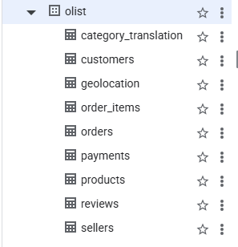

# Project Setup & Data Pipeline

## Status
✅ Dataset downloaded from Kaggle  
✅ All 9 tables uploaded to Google BigQuery  
✅ Schema verified and queries tested  

## BigQuery Dataset Details

- **GCP Project:** olist-bigquery-case-study
- **Dataset Name:** olist
- **Tables Loaded:** 9
- **Total Rows (approx):** ~1.1M rows across all tables

## Tables Successfully Loaded

| Table Name | Rows (approx) | Notes |
|---|---|---|
| orders | 99,441 | Master orders table |
| order_items | 112,650 | |
| customers | 99,441 | |
| products | 32,951 | |
| sellers | 3,095 | |
| payments | 103,886 | |
| reviews | 99,224 | Cleaned before upload — removed unescaped quotes in comment fields |
| geolocation | 1,000,163 | |
| category_translation | 71 | |

## Data Issue Encountered & Fixed

**Table:** `olist_order_reviews_dataset.csv`  
**Issue:** CSV parse error — free-text comment columns contained 
unescaped double quotes and line breaks, causing BigQuery to 
misread row boundaries.  
**Fix:** Dropped `review_comment_title` and `review_comment_message` 
columns before upload since they are not required for this analysis. 
Only `review_score` and metadata fields are used in queries.

## Schema Screenshot

